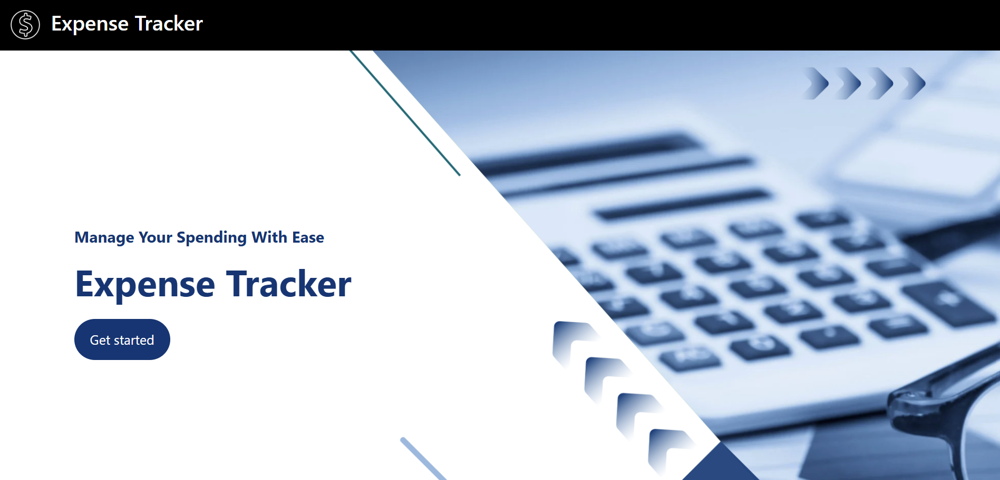
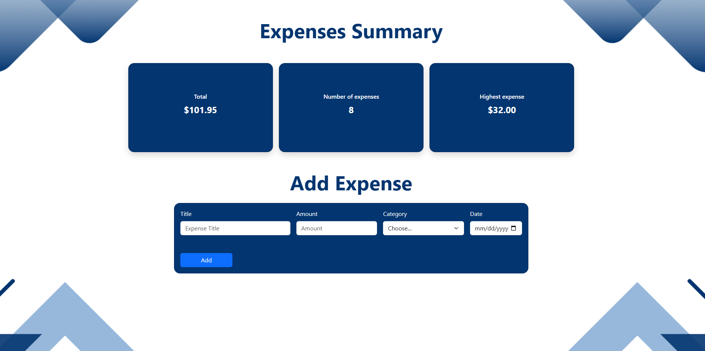
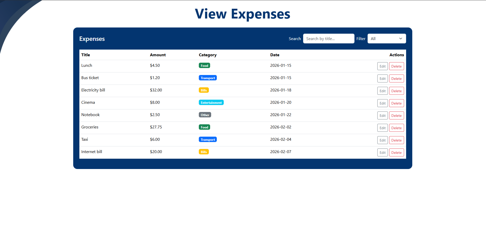

# Expense Tracker

<!-- Write 1-2 sentences: what does your app do? -->

My app baiscally helps users to track their expenses but simply adding an expense and track how many expense do they have and what is the Highest expense and be able to view them in the view expenses section

## How to run

<!-- Write the exact steps someone needs to run your project from scratch.
     Assume they have Node.js, PostgreSQL, and VS Code, and nothing else.
     Include: creating the database, running schema.sql, writing the .env file,
     starting the backend, and opening the frontend. -->

**Backend**

1. Open a terminal in the `backend` folder
2. Create a database named `expense_tracker` in pgAdmin (or via `psql`)
3. Run `schema.sql` against it to create the `expenses` table and sample data
4. Copy `.env.example` to `.env` and fill in your PostgreSQL credentials
5. Run `npm install` to install dependencies
6. Run `node server.js`. The server starts on `http://localhost:3000`

**Frontend**

1. Open the `frontend` folder
2. Open `index.html` with the Live Server extension

## Features

<!-- List what your app can do. Tick what you finished. -->

- [YES] Add an expense (with validation)
- [YES] Delete an expense
- [YES] Edit an expense
- [YES] Filter by category
- [YES] Summary cards (total, count, highest)
- [YES] Data is saved in a PostgreSQL database

## Screenshots

<!-- Add 2-3 screenshots of your app (desktop and mobile). -->

Screenshots are in the front

## What was the hardest part?

<!-- A short paragraph: what got you stuck, and how did you solve it? -->

I think it was dealing with the backend side using express and understanding how to the front talk to the backend. I solved this isssue with searching more and the more i searched is the more im going to know

<!-- DEMO VIDEO -->

https://drive.google.com/file/d/1zJ2LQSD4A43Rz39vuY6L0goUKWy9w93T/view?usp=sharing

## Quick note

I have added a bouns feature which was searching by title. I have noticed this part after I finished recording. I will explain it more in my disscution time if needed.
